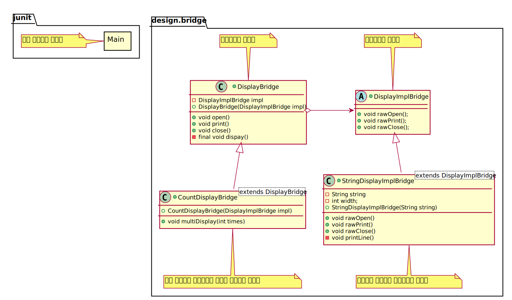

### 클래스 계층의 두가지 역할
> 새로운 기능을 추가하고 싶을 경우 클래스 계층 안에서 자신의 목적과 가까운 클래스를 찾아내 그 하위 클래스를 만들어,  목적한 기능을 추가한 새로운 클래스를 만든다는 것이 기능의 클래스 계층
>> 일반적으로 클래스 계층은 너무 깊게 하지 않는 편이 좋다.
### 새로운 '구현'을 추가하고 싶은 경우
> 새로운 구현을 만들기 위해서 하위 클래스를 만들어 추상 메소드를 구현하게 된다. 이것이 구현의 클래스 계층
### 클래스 계층의 혼재와 클래스 계층의 분리
> '기능의 클래스 계층'과 '구현의 클래스 계층'을 두 개의 독립된 클래스 계층으로 분리