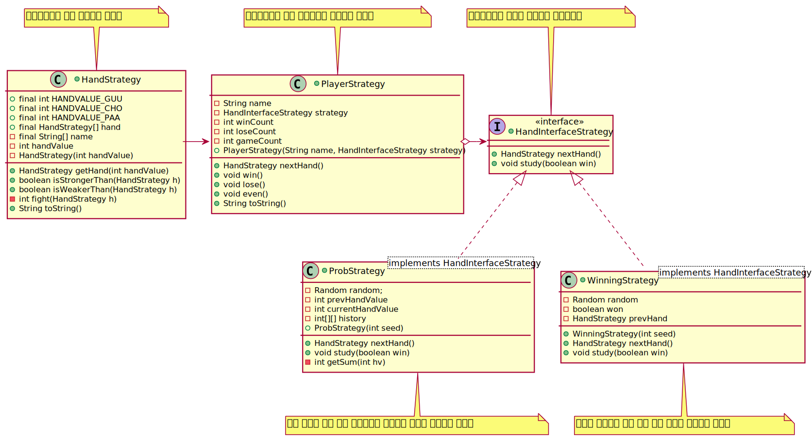

## 이 패턴에서는 알고리즘을 구현한 부분을 모두 교환가능, 문제를 다른 방법으로도 쉽게 해결할 수 있도록 도와주는 패턴임
## 일부러 Strategy 역할을 만들 필요가 있을까?
> 보통 프로그래밍을 할 때 메소드 내부에 동화된 형태로 알고리즘을 구현하기 쉽다.
>
> 그러나 패턴에서는 알고리즘의 부분을 다른 부분과 의식적으로 분리
>
> 프로그램을 복잡하게 만드는 것처럼 보이지만 실제로는 그렇지 않다.
>
> 위임이라는 느슨한 연결을 사용하고 있으므로 알고리즘을 용이하게 교환할 수 있다.
>
> 원래의 알고리즘과 개량한 알고리즘의 속도를 비교하고 싶을 경우에도 간단하게 교체해서 시험할 수 있다.
>
## 실행 중에 교체도 가능
> 버그가 있을지도 모르는 고속의 알고리즘과 저속이지만 확실한 계산을 실행하는 알고리즘이 있다면 비교를 위한 교체가 가능
