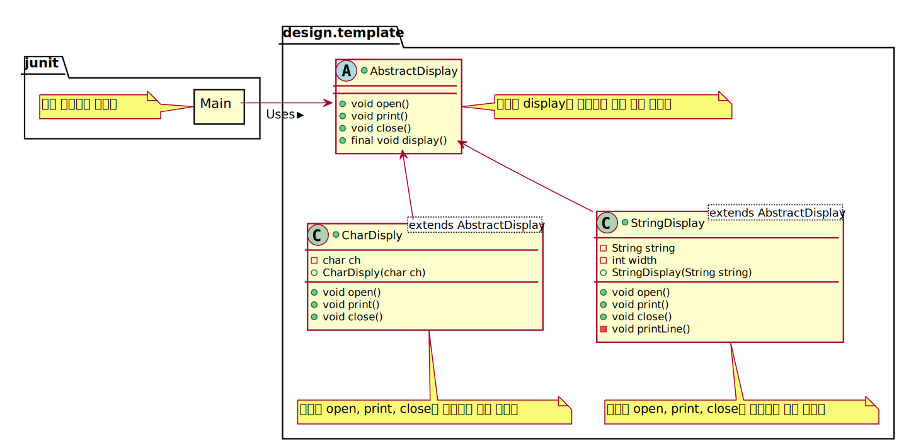

## 로직을 공통화할 수 있다.
> 상위 클래스의 텔플릿 메소드에서 알고리즘이 기술 되어 있으므로, 하위 클레스에서는 알고리즘을 일일이 기술할 필요가 없음
## 상위클래스와 하위 클래스의 연계
> 상위 프로그램에 없으면 하위 클래스에서 구현이 어려울 수도 있다.
## 하위 클래스를 상위 클래스와 동일시한다.
> instaceof 등으로 하위 클래스의 종류를 특정하지 않아도 작동하도록 만드는게 좋다.
> "상위 클래스형의 변수에 하위 클래스의 어떠한 인스턴스를 대입해도 제대로 작동할 수 있도록 한다" - The Liskov Subsititution Principle(LSP)